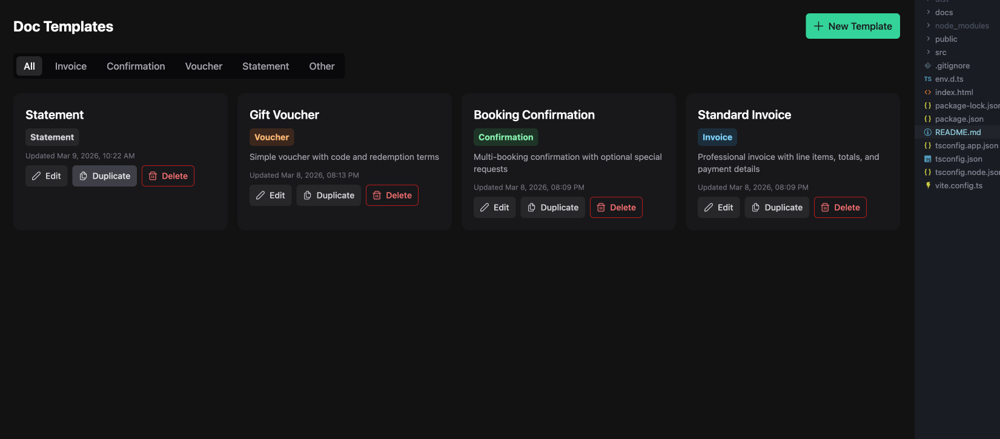
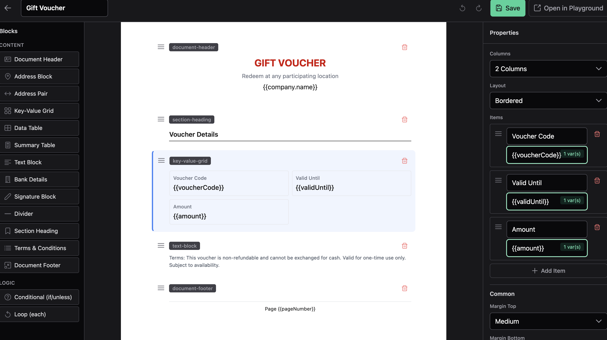
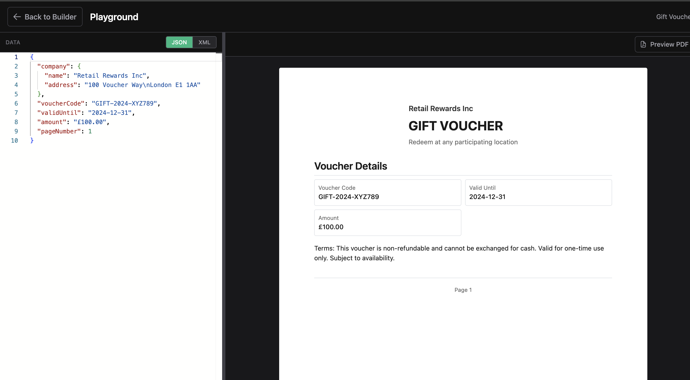

# Doc Templates

A client-side document template builder POC for trading and finance documents (invoices, confirmations, vouchers) with a block-based drag-and-drop editor, Handlebars compilation, and PDF/Word export capabilities.

## 🚀 Live Demo

**Try it now:** [https://jsince99.github.io/template-poc/#/](https://jsince99.github.io/template-poc/#/)

### Screenshots

#### Dashboard


#### Template Builder


#### Playground


## Features

- **Block-Based Editor**: Drag-and-drop interface with 15 block types (13 content blocks + 2 logic containers)
- **Template Management**: Create, edit, duplicate, and delete document templates
- **Handlebars Integration**: Use `{{variables}}` syntax for dynamic content
- **Live Preview**: Test templates with sample data in the playground
- **Export Options**: Export compiled documents as PDF or Word (.docx)
- **Client-Side Storage**: All templates stored locally in IndexedDB using Dexie.js
- **Responsive UI**: Built with PrimeVue components and Tailwind CSS

## Tech Stack

- **Framework**: Vue 3 (Composition API)
- **Build Tool**: Vite
- **UI Library**: PrimeVue 4 with Aura theme
- **Styling**: Tailwind CSS
- **State Management**: Pinia (for global state)
- **Routing**: Vue Router 4
- **Database**: Dexie.js (IndexedDB wrapper)
- **Templating**: Handlebars.js
- **Drag & Drop**: sortablejs-vue3
- **Export**: jsPDF + html2canvas (PDF), docx (Word)
- **Code Editor**: Monaco Editor
- **Language**: TypeScript

## Project Structure

```
doc-templates/
├── docs/
│   ├── plans/                    # Implementation plans
│   └── SESSION_CONTEXT.md        # Session context
├── src/
│   ├── assets/
│   │   └── styles/               # Global styles and document styles
│   ├── blocks/
│   │   ├── editors/              # Property editors for each block type
│   │   ├── palette/              # Block palette component
│   │   └── renderers/            # Preview renderers for each block type
│   ├── compiler/
│   │   └── handlebarsCompiler.ts # Template compilation logic
│   ├── components/               # Reusable UI components
│   ├── db/
│   │   └── index.ts             # Dexie database setup
│   ├── export/
│   │   ├── pdfExport.ts          # PDF export functionality
│   │   └── wordExport.ts         # Word export functionality
│   ├── registry/
│   │   └── blockRegistry.ts      # Block type registry and metadata
│   ├── stores/
│   │   └── templateStore.ts      # Pinia store for template CRUD
│   ├── types/
│   │   └── blocks.ts             # TypeScript type definitions
│   ├── views/
│   │   ├── DashboardView.vue     # Template list and management
│   │   ├── BuilderView.vue       # Template builder (three-panel layout)
│   │   └── PlaygroundView.vue    # Template testing playground
│   ├── App.vue                    # Root component
│   └── main.ts                   # Application entry point
├── index.html
├── package.json
├── vite.config.ts
└── tsconfig.json
```

## Block Types

### Content Blocks (13 types)

1. **Document Header** - Logo, company name, document title
2. **Address Block** - Labeled address card with optional extras
3. **Address Pair** - Two address blocks side by side
4. **Key-Value Grid** - Label/value pairs in a grid layout
5. **Data Table** - Repeating table bound to an array
6. **Summary Table** - Totals, tax, discounts
7. **Text Block** - Free-form text with variables
8. **Bank Details** - Payment/settlement instructions
9. **Signature Block** - Signatory lines with labels
10. **Divider** - Horizontal line or spacer
11. **Section Heading** - Section title with optional underline
12. **Terms & Conditions** - Numbered or bulleted list
13. **Document Footer** - Page footer with three columns

### Logic Blocks (2 types)

1. **Conditional** - Show child blocks based on a condition (if/unless/equals)
2. **Loop** - Repeat child blocks for each item in an array

## Usage

### Creating a Template

1. Navigate to the Dashboard
2. Click "New Template"
3. Enter template name, type, and description
4. Click "Edit" to open the builder

### Building a Template

1. **Left Panel (Palette)**: Drag blocks from the palette onto the canvas
2. **Center Panel (Canvas)**: Arrange blocks by dragging to reorder
3. **Right Panel (Properties)**: Select a block to edit its properties
4. Use Handlebars syntax (`{{variable}}`) in text fields for dynamic content
5. Click "Save" to persist changes

### Testing Templates

1. Navigate to the Playground
2. Select a template from the dropdown
3. Edit the JSON data in the Monaco editor
4. Click "Compile" to see the rendered output
5. Export as PDF or Word using the export buttons

## Handlebars Syntax

Templates use Handlebars syntax for dynamic content:

- **Variables**: `{{variableName}}`
- **Nested Properties**: `{{customer.name}}`, `{{company.address}}`
- **Arrays**: Use with data-table and loop blocks
- **Conditionals**: Use conditional blocks in the builder

## Development

### Key Concepts

- **Blocks**: Each document element is a typed block with properties
- **Templates**: Collections of blocks stored as JSON
- **Compilation**: Templates are converted to Handlebars HTML, then compiled with data
- **Storage**: All templates persist in browser IndexedDB

### Adding a New Block Type

1. Add the type definition to `src/types/blocks.ts`
2. Register the block in `src/registry/blockRegistry.ts`
3. Create a renderer component in `src/blocks/renderers/`
4. Create an editor component in `src/blocks/editors/`
5. Update `BlockRenderer.vue` and `BlockEditor.vue` dispatchers

## License

This project is a proof-of-concept and is not licensed for production use.

## Future Enhancements

- Image block, Chart/Graph block, Watermark block, QR Code block
- Code editor mode with HTML ↔ Block JSON bidirectional conversion
- Template versioning & history
- Template sharing (import/export JSON)
- Server-side rendering for high-fidelity PDF (Puppeteer)
- Custom Handlebars helpers UI
- Undo/redo in builder
- Block copy/paste
- Template categories & tagging

## Development Setup

### Prerequisites

- Node.js 18+ and npm

### Installation

1. Clone the repository:
```bash
git clone <repository-url>
cd doc-templates
```

2. Install dependencies:
```bash
npm install
```

3. Start the development server:
```bash
npm run dev
```

4. Open your browser and navigate to `http://localhost:5173`

### Build for Production

```bash
npm run build
```

The built files will be in the `dist` directory.

### Preview Production Build

```bash
npm run preview
```
